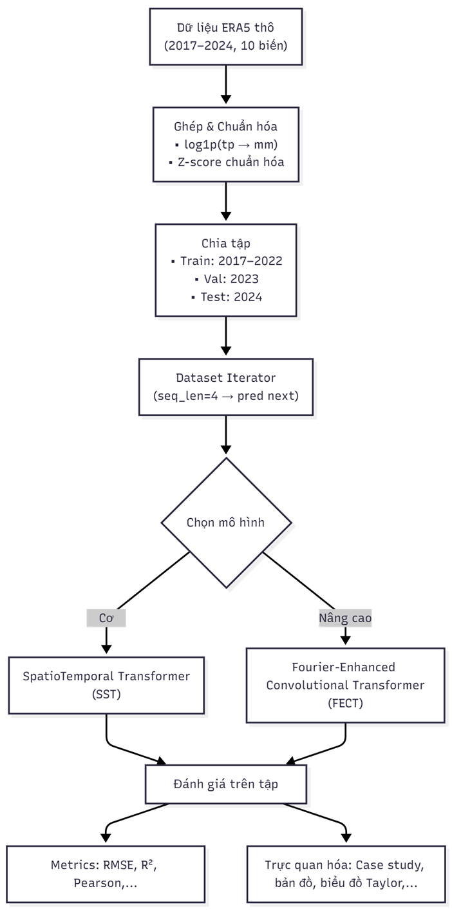
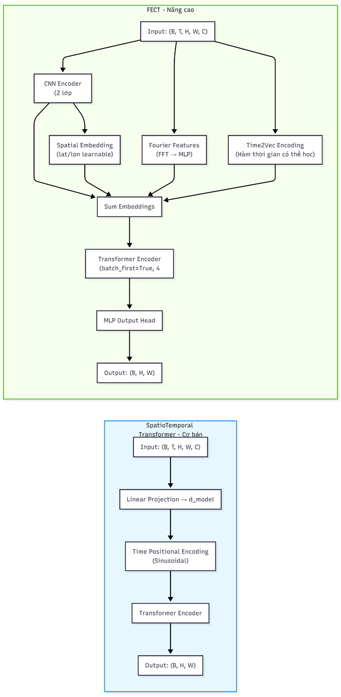

# Dự Án Dự Báo Mưa: Deep Learning Thời Gian-Không Gian Tiên Tiến

> Hệ thống học máy toàn diện để dự báo lượng mưa tại Việt Nam sử dụng dữ liệu tái phân tích ERA5 và mạng nơ-ron sâu.

<div align="center">


[🇻🇳 Tiếng Việt](README_VI.md) | [🇺🇸 English](README.md)

</div>

## 📄 Tài Liệu Dự Án

**Xem trước tài liệu nghiên cứu:**

- 📊 **[Báo Cáo Nghiên Cứu Khoa Học](https://drive.google.com/file/d/1Cxhg5HA4oih5E2pFF0SWeDFgl7aVhWfT/view?usp=sharing)** - Báo cáo chi tiết về phương pháp, kiến trúc mô hình, thực nghiệm và kết quả
- 🎯 **[Slide Thuyết Trình](https://drive.google.com/file/d/1Dwrhw-IcwBDLRsRLCWWoyQrkAwsVRyLE/view?usp=sharing)** - Bản trình bày tóm tắt dự án với trực quan hóa

## 💾 Tải Dữ Liệu & Checkpoints

**📦 Google Drive - Toàn Bộ Dự Án:**

🔗 **[Tải Dữ Liệu, Model Checkpoints & Notebooks](https://drive.google.com/drive/folders/1tf5lpbhOmHLujCH51z2INtnHAZOprNay?usp=sharing)**

Bao gồm:

- ✅ Dữ liệu ERA5 gốc (2017-2024)
- ✅ Dữ liệu đã xử lý (train/val/test)
- ✅ Model checkpoints đã train
- ✅ Notebooks và kết quả

> **Lưu ý**: Do giới hạn 100MB/file của GitHub, dữ liệu lớn (~45GB) được lưu trữ trên Google Drive. Xem chi tiết tại [DATA_DOWNLOAD.md](DATA_DOWNLOAD.md)

---

## Tổng Quan

Dự án này triển khai hai kiến trúc mạng nơ-ron thời gian-không gian tiên tiến cho dự báo lượng mưa tại Việt Nam:

1. **Spatio-Temporal Transformer** - Phương pháp thuần túy dựa trên Transformer cho dự báo thời tiết theo chuỗi
2. **Fourier-Enhanced Convolutional Transformer (FECT)** - Kiến trúc kết hợp:
   - Các lớp tích chập (Convolutional) để trích xuất đặc trưng không gian cục bộ
   - Các module Transformer để học phụ thuộc toàn cục
   - Time2Vec để mã hóa thời gian có thể học được
   - Các đặc trưng biến đổi Fourier để nắm bắt các mẫu tuần hoàn
   - Cơ chế chú ý không gian (Spatial Attention) để đánh giá tầm quan trọng của đặc trưng địa lý

Các mô hình tận dụng 8 năm dữ liệu tái phân tích ERA5 (2017-2024) bao gồm 10 biến khí tượng để dự đoán tổng lượng mưa với độ chính xác cao.

## Cấu Trúc Dự Án

```
Rain_Forecast_Project/
├── 1_Data_Raw/                          # Dữ liệu thời tiết ERA5 thô
│   ├── era5_2017_2020/                  # 10 biến × 2 giai đoạn
│   └── era5_2021_2024/
├── 2_Data_Processed/                    # Bộ dữ liệu đã xử lý và chuẩn hóa
│   ├── train_2017_2022.nc               # Tập huấn luyện
│   ├── val_2023.nc                      # Tập xác thực
│   ├── test_2024.nc                     # Tập kiểm tra
│   ├── era5_vn_merged_normalized_2017_2024.nc
│   └── normalization_stats_2017_2024.json
├── 3_Models/                            # Notebooks huấn luyện và đánh giá
│   ├── 1_Spatio_Temporal_Transformer/
│   │   └── Train_Spatio_Temporal_Transformer.ipynb
│   └── 2_Fourier_Convolutional_Transformer/
│       ├── 1_Train_Fourier_Convolutional_Transformer.ipynb
│       ├── 2_Evaluation_and_Inference.ipynb
│       └── 3_Visualize_Learning_Curves.ipynb
├── 4_Checkpoints/                       # Trọng số mô hình đã lưu
│   ├── Fourier_Convolutional_Transformer/
│   │   └── 20251024_051938/
│   │       ├── epoch_1.pth đến epoch_22.pth
│   │       └── best_model.pth
│   └── Spatio_Temporal_Transformer/
│       └── 20251019_084207/
├── 5_Results/                           # Các chỉ số đánh giá và trực quan hóa
│   └── evaluation_results_Fourier_Convolutional_Transformer/
│       ├── quantitative_metrics.csv
│       ├── seasonal_metrics_comparison.csv
│       └── (Các hình ảnh PNG đa dạng)
└── Data_Preprocessing_Notebooks/        # Pipeline xử lý dữ liệu
    ├── 1_Era5_Weather_Data_Download.ipynb
    ├── 2_Data_Discovery.ipynb
    └── 3_Data_Merged_and_Normalized.ipynb
```

## Tính Năng Chính

<div align="center">

### 🌍 Quy Trình Xử Lý Dữ Liệu



</div>

### 📊 Pipeline Dữ Liệu ERA5

- **Dữ liệu Tái Phân Tích ERA5**: 10 biến khí tượng với độ phân giải 0.25°

  - Nhiệt độ 2m (t2m)
  - Nhiệt độ điểm sương 2m (d2m)
  - Thành phần gió U/V 10m (u10, v10)
  - Áp suất mực nước biển trung bình (msl)
  - Áp suất bề mặt (sp)
  - Tổng lượng mưa (tp) - **Biến mục tiêu**
  - Bức xạ mặt trời bề mặt (ssrd)
  - Nhiệt độ bề mặt da (skt)
  - Tổng lượng hơi nước cột (tcwv)

- **Phạm vi thời gian**: 2017-2024 (8 năm)
- **Phạm vi địa lý**: Khu vực Việt Nam (8°N-24°N, 102°E-110°E)
- **Độ phân giải thời gian**: Đo 2 giờ một lần
- **Chuẩn hóa**: Chuẩn hóa Z-score với thống kê được lưu trữ

### Kiến Trúc Mô Hình

<div align="center">

#### 🏗️ So Sánh Hai Kiến Trúc Mô Hình



_Hai kiến trúc: **FECT** (nâng cao với CNN, Fourier, Time2Vec) và **SST** (cơ bản với Transformer)_

</div>

**⚡ Ưu điểm của FECT (Mô hình chính):**

- 🔹 **CNN Encoder**: Trích xuất đặc trưng không gian cục bộ hiệu quả
- 🔹 **Time2Vec**: Mã hóa thời gian có thể học, vượt trội embedding sin chuẩn
- 🔹 **Fourier Features**: Nắm bắt mẫu tuần hoàn thời tiết trong miền tần số
- 🔹 **Spatial Attention**: Học tầm quan trọng của từng vùng địa lý
- 🔹 **Transformer Stack**: 4 lớp, 8 heads, xử lý phụ thuộc toàn cục

**⚙️ Cấu hình huấn luyện:**

- Sequence Length: 4 steps (8h) | Model Dim: 128 | Heads: 8 | Layers: 4
- Batch: 8 | Learning Rate: 1e-4 | Optimizer: Adam | Dropout: 0.1

### Đánh Giá & Kết Quả

Các mô hình đạt hiệu suất cao trên nhiều chỉ số:

**Chỉ số định lượng**:

- Mean Squared Error (MSE) - Sai số bình phương trung bình
- Mean Absolute Error (MAE) - Sai số tuyệt đối trung bình
- Root Mean Squared Error (RMSE) - Căn bậc hai sai số bình phương trung bình
- R² Score - Hệ số xác định
- Mean Absolute Percentage Error (MAPE) - Sai số phần trăm tuyệt đối trung bình

**Phân tích định tính**:

- So sánh hiệu suất theo mùa (Mùa khô, Chuyển tiếp, Mùa mưa)
- Phân tích phân bố sai số
- Trực quan hóa chuỗi thời gian với dự đoán so với thực tế
- Nghiên cứu tình huống với bản đồ chú ý địa lý

**Bộ công cụ trực quan hóa**:

- Sơ đồ khái niệm Time2Vec
- Minh họa kiến trúc CNN Encoder
- Bản đồ nhiệt Spatial Attention
- So sánh hiệu suất theo mùa
- Phân bố và xu hướng sai số

## Bắt Đầu

### Yêu Cầu Tiên Quyết

- Python 3.8+
- CUDA 11.0+ (cho tăng tốc GPU)
- Bộ nhớ GPU 8GB+ (khuyến nghị)

### Cài Đặt

```bash
# Clone repository
git clone https://github.com/yourusername/Rain_Forecast_Project.git
cd Rain_Forecast_Project

# Tạo môi trường ảo
python -m venv venv
source venv/bin/activate  # Trên Windows: venv\Scripts\activate

# Cài đặt các thư viện phụ thuộc
pip install -r requirements.txt
```

### Bắt Đầu Nhanh

#### 1. Chuẩn Bị Dữ Liệu (Tùy chọn - Đã bao gồm dữ liệu đã xử lý)

```bash
# Tải dữ liệu ERA5
jupyter notebook Data_Preprocessing_Notebooks/1_Era5_Weather_Data_Download.ipynb

# Khám phá và xác thực dữ liệu
jupyter notebook Data_Preprocessing_Notebooks/2_Data_Discovery.ipynb

# Hợp nhất và chuẩn hóa
jupyter notebook Data_Preprocessing_Notebooks/3_Data_Merged_and_Normalized.ipynb
```

#### 2. Huấn Luyện

**Fourier-Enhanced Convolutional Transformer**:

```bash
jupyter notebook 3_Models/2_Fourier_Convolutional_Transformer/1_Train_Fourier_Convolutional_Transformer.ipynb
```

**Spatio-Temporal Transformer**:

```bash
jupyter notebook 3_Models/1_Spatio_Temporal_Transformer/Train_Spatio_Temporal_Transformer.ipynb
```

#### 3. Đánh Giá & Suy Luận

```bash
jupyter notebook 3_Models/2_Fourier_Convolutional_Transformer/2_Evaluation_and_Inference.ipynb
```

#### 4. Trực Quan Hóa

```bash
jupyter notebook 3_Models/2_Fourier_Convolutional_Transformer/3_Visualize_Learning_Curves.ipynb
```

## Ví Dụ Sử Dụng

### Tải Mô Hình Đã Huấn Luyện

```python
import torch
import xarray as xr

# Tải mô hình
model = FourierEnhancedConvTransformer(
    n_features=10,
    d_model=128,
    n_heads=8,
    n_layers=4,
    dropout=0.1
)
checkpoint = torch.load('4_Checkpoints/Fourier_Convolutional_Transformer/20251024_051938/best_model.pth')
model.load_state_dict(checkpoint['model_state_dict'])
model.eval()

# Tải dữ liệu kiểm tra
test_data = xr.open_dataset('2_Data_Processed/test_2024.nc')

# Thực hiện dự đoán
with torch.no_grad():
    predictions = model(input_batch)
```

### Truy Cập Kết Quả

```python
import pandas as pd

# Tải các chỉ số đánh giá
metrics = pd.read_csv('5_Results/evaluation_results_Fourier_Convolutional_Transformer/quantitative_metrics.csv')
seasonal = pd.read_csv('5_Results/evaluation_results_Fourier_Convolutional_Transformer/seasonal_metrics_comparison.csv')

print(metrics)
print(seasonal)
```

## Chi Tiết Kỹ Thuật

### Tiền Xử Lý Dữ Liệu

- **Căn chỉnh**: Tất cả biến được nội suy về lưới không gian chung (65×33 điểm)
- **Chuẩn hóa**: Chuẩn hóa Z-score cho mỗi biến
- **Phân chia Train/Val/Test**:
  - Huấn luyện: 2017-2022 (5 năm)
  - Xác thực: 2023 (1 năm)
  - Kiểm tra: 2024 (1 năm)
- **Chuỗi thời gian**: Cửa sổ trượt với 4 bước nhìn lại
- **Định dạng**: NetCDF4 cho lưu trữ đa chiều hiệu quả

### Huấn Luyện Mô Hình

- **Hàm mất mát**: Mean Squared Error (MSE)
- **Bộ tối ưu**: Adam với weight decay (điều chuẩn L2)
- **Lịch tốc độ học**: Thích ứng dựa trên hiệu suất xác thực
- **Early Stopping**: Theo dõi kiên nhẫn validation loss
- **Chiến lược Checkpoint**: Lưu mô hình tốt nhất và các snapshot định kỳ
- **Thiết bị**: Tự động phát hiện GPU với fallback CPU

### Chiến Lược Đánh Giá

- **Temporal CV**: Phân chia theo thời gian (không rò rỉ dữ liệu)
- **Chỉ số**: Bao gồm các chỉ số hồi quy và chuyên ngành
- **Phân tích theo mùa**: Đánh giá riêng cho các giai đoạn khô/mưa/chuyển tiếp
- **Trực quan hóa địa lý**: Bản đồ chú ý để giải thích
- **Nghiên cứu tình huống**: Phân tích chi tiết các trường hợp dự báo cụ thể

## Tóm Tắt Kết Quả

**Fourier-Enhanced Convolutional Transformer** đạt được:

- Nắm bắt vượt trội các mẫu thời tiết tuần hoàn thông qua đặc trưng Fourier
- Spatial attention hiệu quả cho dự đoán nhận biết địa lý
- Mã hóa thời gian vững chắc với Time2Vec
- Hiệu suất cân bằng qua các biến động theo mùa

Các checkpoint cho thấy cải thiện tiến bộ qua các epoch huấn luyện (lưu từ 1-22), với `best_model.pth` đại diện cho hiệu suất xác thực đỉnh cao.

## Thư Viện Phụ Thuộc

Các thư viện cốt lõi:

- **PyTorch** 2.0+ - Framework học sâu
- **xarray** - Xử lý dữ liệu đa chiều
- **numpy/pandas** - Thao tác dữ liệu
- **scikit-learn** - Chỉ số và tiền xử lý
- **matplotlib/cartopy** - Trực quan hóa
- **cdsapi** - Tải dữ liệu ERA5

Xem `requirements.txt` để biết danh sách đầy đủ và phiên bản.

## Tổng Quan Các Notebook Chính

| Notebook                                          | Mục đích                           | Đầu vào                            | Đầu ra                                   |
| ------------------------------------------------- | ---------------------------------- | ---------------------------------- | ---------------------------------------- |
| `1_Era5_Weather_Data_Download.ipynb`              | Tải dữ liệu thô từ Copernicus      | Thông tin đăng nhập API            | Các file NetCDF (2017-2024)              |
| `2_Data_Discovery.ipynb`                          | Phân tích khám phá dữ liệu         | Các file NetCDF thô                | Tóm tắt thống kê, trực quan hóa          |
| `3_Data_Merged_and_Normalized.ipynb`              | Pipeline tiền xử lý                | Dữ liệu đa file thô                | Phân chia train/val/test + thống kê      |
| `1_Train_Fourier_Convolutional_Transformer.ipynb` | Huấn luyện mô hình                 | Bộ dữ liệu đã chuẩn hóa            | Checkpoints, đường cong loss             |
| `2_Evaluation_and_Inference.ipynb`                | Đánh giá tập kiểm tra              | Checkpoint tốt nhất + dữ liệu test | Chỉ số, dự đoán, phân tích sai số        |
| `3_Visualize_Learning_Curves.ipynb`               | Trực quan hóa quá trình huấn luyện | Logs loss                          | Đường cong huấn luyện, biểu đồ hiệu suất |

## Cải Tiến Trong Tương Lai

- [ ] Dự báo nhiều bước tiến (vượt khung dự đoán 2 giờ)
- [ ] Phương pháp Ensemble kết hợp cả hai kiến trúc
- [ ] Pipeline triển khai vận hành
- [ ] Định lượng độ không chắc chắn với khoảng dự đoán
- [ ] Mở rộng sang các biến khí tượng khác
- [ ] Transfer learning khu vực sang các nước láng giềng
- [ ] API suy luận thời gian thực với FastAPI
- [ ] Tối ưu hóa siêu tham số với Optuna/Ray Tune

## Trích Dẫn

Nếu bạn sử dụng dự án này trong nghiên cứu của mình, vui lòng trích dẫn:

```bibtex
@project{RainForecastProject2025,
  title={Advanced Spatio-Temporal Deep Learning for Rainfall Prediction in Vietnam},
  author={Your Name},
  year={2025},
  url={https://github.com/yourusername/Rain_Forecast_Project}
}
```

## Giấy Phép

Dự án này được cấp phép theo Giấy phép MIT - xem file LICENSE để biết chi tiết.

## Liên Hệ & Hỗ Trợ

- **Email**: huynhhuutri2004@gmail.com
- **GitHub**: [@cheesenoice](https://github.com/cheesenoice)
- **LinkedIn**: [Trí Huỳnh](https://www.linkedin.com/in/trisdev)

## Lời Cảm Ơn

- **Nguồn dữ liệu**: Copernicus Climate Data Store (ERA5 Reanalysis)
- **Phạm vi địa lý**: Tổng cục Khí tượng Thủy văn Việt Nam
- **Nguồn cảm hứng**: Những tiến bộ gần đây trong học sâu thời gian-không gian, cơ chế chú ý, và mạng nơ-ron Fourier

---

**Trạng thái dự án**: ✅ Hoàn thành | **Cập nhật lần cuối**: Tháng 12/2025 | **Phiên bản**: 1.0
